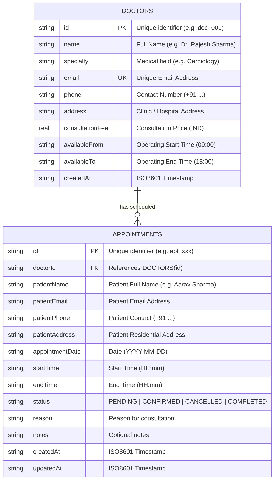

# SmartCare: Healthcare & Consultation Appointment Booking Backend System

> **Internship Track Evaluation Project — Role: Backend Developer (Beginner Level)**  
> A production-grade, layered REST API built with Node.js, Express, SQLite, and Joi, demonstrating realistic business logic, database relationships, input validation, conflict prevention, and standardized error handling.

---

## 📑 Table of Contents
1. [Business Problem & Use Case](#-business-problem--use-case)
2. [Key Highlights & Business Logic](#-key-highlights--business-logic)
3. [Architecture & Project Structure](#-architecture--project-structure)
4. [Database Design & Schema](#-database-design--schema)
5. [API Specification](#-api-specification)
6. [Installation & Setup Guide](#-installation--setup-guide)
7. [Testing the API](#-testing-the-api)
   - [Automated Integration Test Suite](#1-automated-integration-test-suite)
   - [Postman Collection Testing](#2-postman-collection-testing)
8. [Internship Evaluation & Viva Talking Points](#-internship-evaluation--viva-talking-points)

---

## 🩺 Business Problem & Use Case

In a typical healthcare or consultation business, clients must schedule appointments with doctors or consultants across discrete time intervals. A simplistic CRUD application often permits booking conflicts, accepts past dates, lacks status integrity, and fails to communicate validation errors clearly.

**SmartCare** solves this with a realistic backend flow:
* **Doctors/Providers** register with their medical specialty, consultation fees, and available daily working hours.
* **Patients** query free time slots for a specific date and book an appointment.
* The system enforces **anti-conflict checks**, **working hours verification**, **past-date restrictions**, and **strict status lifecycles** (`PENDING` $\rightarrow$ `CONFIRMED` $\rightarrow$ `COMPLETED` / `CANCELLED`).

---

## ⚡ Key Highlights & Business Logic

| Business Rule / Feature | Implementation Detail | HTTP Status |
| :--- | :--- | :---: |
| **Double-Booking Prevention** | Before creating a booking, the service queries active appointments for the provider on that date. If overlapping intervals are detected, the request is rejected with an explanatory conflict message. | `409 Conflict` |
| **Past-Date Rejection** | Appointments cannot be scheduled in the past. Date and start time are checked against current server time. | `400 Bad Request` |
| **Operating Hours Enforcement** | Appointments must fall within the doctor's declared operating hours (e.g. 09:00 to 18:00). | `400 Bad Request` |
| **State Machine Transitions** | Status moves predictably: <br>• `PENDING` $\rightarrow$ `CONFIRMED` or `CANCELLED` <br>• `CONFIRMED` $\rightarrow$ `COMPLETED` or `CANCELLED` <br>• `CANCELLED` / `COMPLETED` are terminal states (immutable). | `200 OK` / `400 Bad Request` |
| **Dynamic Slot Availability** | Endpoint dynamically partitions working hours into 30-minute intervals, checks existing bookings, and marks each slot as `{ isAvailable: true/false, reason }`. | `200 OK` |
| **Strict Schema Validation** | Request bodies, query parameters, and route parameters are validated using Joi. Malformed payloads return field-level error messages before touching the database. | `400 Bad Request` |
| **Centralized Error Handling** | Domain error classes (`NotFoundError`, `ConflictError`, `ValidationError`, `BadRequestError`) caught by global middleware, preventing server crashes and obscuring internal stack traces. | Any appropriate code |

---

## 🏗 Architecture & Project Structure

The project follows the **Layered Architecture (Controller-Service-Repository)** pattern to ensure strict separation of concerns, maintainability, and testability.

```
appointment-booking-backend/
├── src/
│   ├── config/
│   │   ├── env.js                     # Environment variable validation & defaults
│   │   └── database.js                # SQLite database setup, schemas, and seeding
│   ├── controllers/
│   │   ├── appointment.controller.js  # HTTP request/response orchestration
│   │   └── doctor.controller.js       # Doctor HTTP interactions
│   ├── services/
│   │   ├── appointment.service.js     # Business logic, conflict check, state transitions
│   │   └── doctor.service.js          # Doctor & schedule business calculations
│   ├── repositories/
│   │   ├── appointment.repository.js  # Direct SQL/data queries for appointments
│   │   └── doctor.repository.js       # Direct SQL/data queries for doctors
│   ├── validators/
│   │   ├── appointment.validator.js   # Joi schemas for appointment requests
│   │   └── doctor.validator.js        # Joi schemas for doctor requests
│   ├── middlewares/
│   │   ├── validate.middleware.js     # Reusable request validation interceptor
│   │   ├── error.middleware.js        # Global error catcher & JSON formatter
│   │   └── notFound.middleware.js     # 404 Route Not Found handler
│   ├── utils/
│   │   ├── apiResponse.js             # Consistent response formatting envelope
│   │   ├── apiError.js                # Custom domain error class hierarchy
│   │   └── dateHelper.js              # Time overlap & slot calculation utilities
│   ├── routes/
│   │   ├── index.js                   # API v1 central router & health check
│   │   ├── appointment.routes.js      # /api/v1/appointments routes
│   │   └── doctor.routes.js           # /api/v1/doctors routes
│   └── app.js                         # Express app pipeline & middleware setup
├── postman/
│   ├── SmartCare_API_Collection.json  # Postman v2.1 collection with test assertions
│   └── SmartCare_Environment.json     # Postman environment configuration
├── tests/
│   └── runTests.js                    # Automated integration & regression test runner
├── data/
│   └── smartcare.db                   # SQLite database (auto-created & auto-seeded)
├── .env.example                       # Documented environment variables template
├── .env                               # Local environment configuration
├── package.json                       # Scripts and dependencies
├── server.js                          # Server startup entry point
└── README.md                          # Comprehensive documentation
```

### Request Flow
$$\text{Client} \longrightarrow \text{Routes} \longrightarrow \text{Validation Middleware} \longrightarrow \text{Controller} \longrightarrow \text{Service} \longrightarrow \text{Repository} \longrightarrow \text{Database}$$

---

## 🗄 Database Design & Schema

Persistent storage is powered by **SQLite** with foreign keys, indexes, and automated initial seeding.

### Entity Relationship Diagram (ERD)



### Database Performance Indexes
* `idx_appointments_doctor_date`: Accelerates slot availability queries and overlap conflict detection.
* `idx_appointments_status`: Speeds up status-based filtering and analytics queries.

---

## 📡 API Specification

All responses follow a predictable JSON envelope:
```json
// Success Response
{
  "success": true,
  "message": "Appointment successfully booked",
  "data": { ... },
  "pagination": { "page": 1, "limit": 10, "total": 1, "totalPages": 1 } // (when applicable)
}

// Error Response
{
  "success": false,
  "message": "Invalid request data",
  "errors": [
    { "field": "patientEmail", "message": "A valid patient email address is required" }
  ]
}
```

### Endpoints Overview

| Method | Endpoint | Description | Status Code |
| :--- | :--- | :--- | :---: |
| `GET` | `/api/v1/health` | System health check and uptime status | `200` |
| `GET` | `/api/v1/doctors` | List all registered doctors | `200` |
| `GET` | `/api/v1/doctors/:id` | Get single doctor details by ID | `200` / `404` |
| `POST` | `/api/v1/doctors` | Register a new doctor | `201` / `400` / `409` |
| `GET` | `/api/v1/doctors/:id/available-slots?date=YYYY-MM-DD` | Calculate free time slots on a specific date | `200` / `400` / `404` |
| `POST` | `/api/v1/appointments` | Book an appointment (with conflict checks) | `201` / `400` / `409` |
| `GET` | `/api/v1/appointments` | Search & list appointments (filters: `status`, `doctorId`, `date`, `page`, `limit`) | `200` |
| `GET` | `/api/v1/appointments/:id` | Get appointment details by ID | `200` / `404` |
| `PATCH` | `/api/v1/appointments/:id/status` | Update status (`CONFIRMED`, `CANCELLED`, `COMPLETED`) | `200` / `400` / `404` |
| `DELETE`| `/api/v1/appointments/:id` | Cancel an appointment | `200` / `404` |

---

## 🚀 Installation & Setup Guide

### 1. Prerequisites
* **Node.js** v18.0.0 or higher
* **npm** v8.0.0 or higher

### 2. Setup
```bash
# Navigate to the project directory
cd appointment-booking-backend

# Install dependencies
npm install

# Start the server
npm start
```

For development mode with automatic restart on file changes:
```bash
npm run dev
```

The server will initialize SQLite and automatically seed 3 doctors on the first run:
```text
🚀 SmartCare Appointment Booking Server is running
📍 URL: http://localhost:5000
🩺 Health Check: http://localhost:5000/api/v1/health
📋 Doctors API: http://localhost:5000/api/v1/doctors
📅 Appointments API: http://localhost:5000/api/v1/appointments
```

---

## 🧪 Testing the API

### 1. Automated Integration Test Suite
The project includes a self-contained automated test suite testing **38 verification scenarios**:
```bash
npm test
```
**Test Coverage Includes:**
* ✅ Health check endpoint returns 200 and `status: UP`
* ✅ Doctor listing and retrieval
* ✅ Validation catches missing fields, malformed emails, and invalid phone numbers
* ✅ Business rule rejects past dates
* ✅ Happy path appointment creation returns 201 with generated ID
* ✅ Anti-conflict logic catches double bookings and returns `409 Conflict`
* ✅ Dynamic available slots marks booked slots as unavailable
* ✅ Finite state-machine allows valid transitions (`PENDING` $\rightarrow$ `CONFIRMED`)
* ✅ Finite state-machine rejects illegal transitions (`CONFIRMED` $\rightarrow$ `PENDING`) with 400
* ✅ Cancellation marks appointment as `CANCELLED` and frees up slot for other patients
* ✅ 404 handler intercepts unknown routes cleanly

### 2. Postman Collection Testing
1. Open **Postman**.
2. Click **Import** $\rightarrow$ select the files:
   - `postman/SmartCare_API_Collection.json`
   - `postman/SmartCare_Environment.json`
3. Select the **SmartCare Local Environment**.
4. Run individual requests or run the entire collection using **Run Collection**. Every request contains automated assertions.
